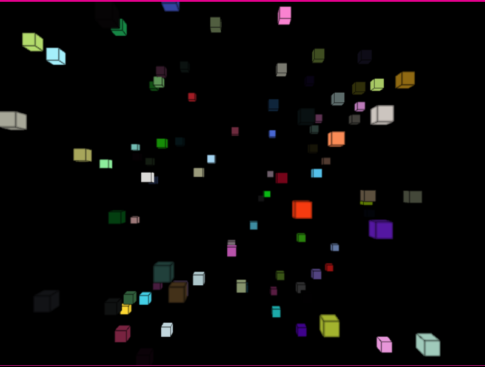

# shaders-interact

## Objetivo

Apropiarse de los conceptos de Shaders, su funcionamiento en la GPU y el uso de OpenGL Shading Language (GLSL) como lenguaje de alto nivel para shaders y el uso de la librería frames.

## Integrantes

|    Integrante    | github nick |
|------------------|-------------|
| Eduardo Galeano  | cegard     |
| Jhonatan Guzmán  | Jhonnyguzz    |

## Desarrollo

Dado el ejemplo DOF (Depth of Field) dado por la librería se busca dar solución al enfoque de cada caja en la escena a partir del Shader dado, manipulando su grado de profundidad mediante el control de teclas, cada vez que se oprimen las teclas, las cajas se enfocan y desenfocan según el grado.

## Resultados

Mediante el uso de las teclas + y - se puede ver el enfoque de las cajas:

## Trabajo futuro

Implementar una forma de enfocar cada caja cuando el puntero del mouse pasa por encima de cada caja sin manipular las coordenadas de la escena

## Referencias

[PShader](https://processing.org/tutorials/pshader/)
[Frames](https://github.com/VisualComputing/framesjs)
[Shaders Examples](http://www.lighthouse3d.com/tutorials/glsl-12-tutorial/shader-examples/)
